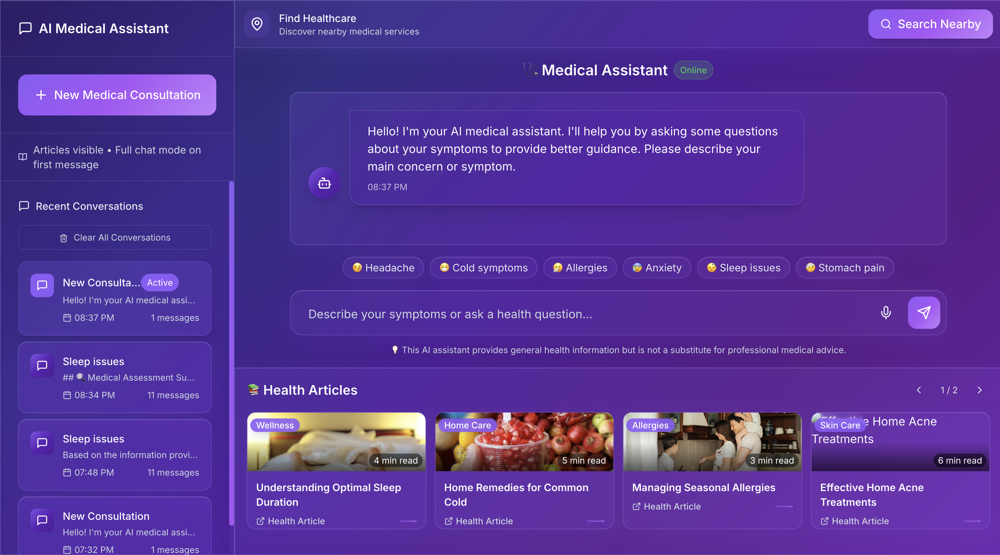
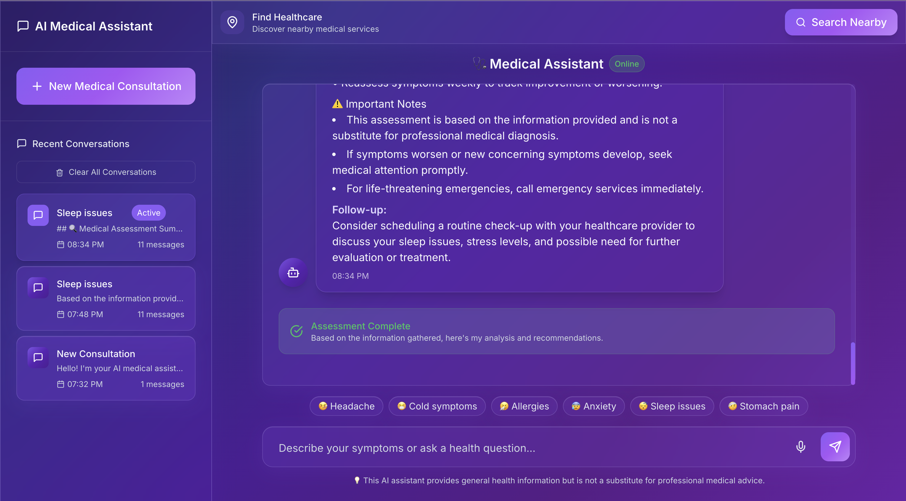
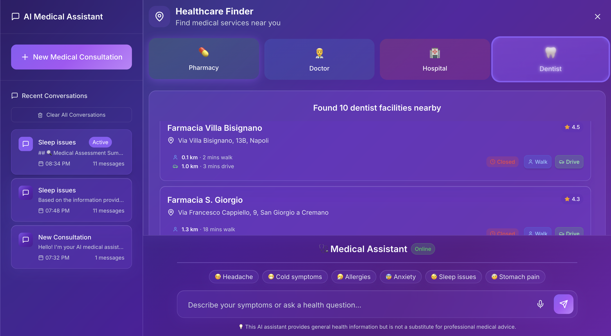

# AI Medical Chatbot - Comprehensive Healthcare Assistant

An advanced AI-powered medical assistant that provides interactive symptom triage, location-based healthcare services, and AI-generated medical content using the Sonar API (Perplexity) for intelligent medical reasoning.

### Chatbot Previews
- 
- 
- 

## 🚀 Key Features

### 🔬 **Advanced Medical Triage System**
- **Iterative Questioning**: AI progressively asks follow-up questions with clickable response options
- **Contextual Assessment**: 5-step triage process leading to comprehensive medical evaluation
- **Smart Response Options**: Quick-select buttons for symptoms, duration, severity, and medical history
- **Final Assessment**: Detailed medical analysis with:
  - Primary concern summary
  - Possible conditions and differential diagnosis
  - Urgency level assessment
  - Immediate action recommendations
  - When to seek professional care
  - Self-care instructions
  - Monitoring guidelines

### 📍 **Enhanced Location Services**
- **Real-time Healthcare Finder**: Locate nearby medical facilities using GPS
- **Multiple Healthcare Types**: Pharmacies, doctors, hospitals, dentists
- **Travel Time Integration**: Google Distance Matrix API for accurate walking/driving times
- **Interactive Mapping**: Direct links to Google Maps with route planning
- **Facility Details**: Ratings, operating hours, contact information
- **Responsive Design**: Large, scrollable interface with compact information density

### 📚 **AI-Generated Article System**
- **Dynamic Content Creation**: Click any article to generate comprehensive medical content
- **Sonar API Integration**: Real-time article generation on health topics
- **Professional Formatting**: Markdown-rendered content with medical disclaimers
- **Comprehensive Coverage**: 800-1200 word articles with:
  - Introduction and key facts
  - Practical recommendations
  - When to seek medical attention
  - Evidence-based information
  - Proper medical disclaimers

### 💬 **Smart Chat Management**
- **Session-Based Conversations**: Unique chat IDs for organized history
- **Persistent Storage**: Conversations saved in localStorage
- **Chat History Sidebar**: Browse, delete, and manage previous consultations
- **Adaptive UI**: Articles disappear when chat begins for focused experience
- **New Consultation Button**: Start fresh medical assessments easily

### 🎨 **Professional UI/UX**
- **Glass Morphism Design**: Modern, translucent interface elements
- **Purple Medical Theme**: Professional color scheme with accessibility focus
- **Responsive Layout**: Optimized for desktop, tablet, and mobile
- **Smooth Animations**: Fade-in effects, hover states, and micro-interactions
- **Custom Scrollbars**: Enhanced scrolling experience throughout the app
- **Loading States**: Professional loading indicators for all async operations

## 🛠 Tech Stack

### Frontend
- **React 18** with TypeScript
- **Tailwind CSS** for utility-first styling
- **Lucide React** for consistent iconography
- **React Markdown** for rich content rendering
- **Context API** for state management
- **localStorage** for data persistence
- **Responsive Design** with mobile-first approach

### Backend
- **Node.js** with Express.js
- **Sonar API (Perplexity)** for AI medical reasoning
- **Google Places API** for location services
- **Google Distance Matrix API** for travel times
- **Axios** for HTTP requests
- **CORS** enabled for cross-origin requests
- **Environment-based configuration**

### APIs & Services
- **Sonar Pro Model**: Advanced medical reasoning and content generation
- **Google Maps Integration**: Places search and directions
- **Real-time Geolocation**: Browser-based location services
- **Medical Content Database**: Curated health articles

## 🚀 Getting Started

### Prerequisites
- Node.js (v16 or later)
- npm or yarn
- Perplexity API key (Sonar)
- Google Cloud Platform account with Places/Maps APIs enabled

### Installation

1. **Clone the repository**
```bash
git clone https://github.com/yourusername/ai-medical-chatbot.git
cd ai-medical-chatbot
```

2. **Install dependencies**
```bash
npm install
```

3. **Environment Configuration**
Create a `.env` file in the root directory:
```env
# API Keys
SONAR_API_KEY=your_perplexity_api_key_here
GOOGLE_PLACES_API_KEY=your_google_places_api_key_here

# Server Configuration
PORT=5002
CLIENT_URL=http://localhost:5173

# Development Settings
NODE_ENV=development
```

4. **Start Development Server**
```bash
npm run dev
```

This starts both the backend server (port 5002) and frontend client (port 5173) with hot reloading.

## 📁 Project Structure

```
ai-medical-chatbot/
├── server/                     # Backend Express server
│   ├── routes/
│   │   ├── chatRoutes.js      # Sonar API integration & triage logic
│   │   ├── articlesRoutes.js  # Article management & AI generation
│   │   └── placesRoutes.js    # Location services & travel times
│   ├── data/
│   │   └── articles.json      # Static health articles database
│   └── index.js               # Server entry point & configuration
├── src/                       # React frontend application
│   ├── components/
│   │   ├── chat/              # Chat interface components
│   │   │   ├── ChatInterface.tsx
│   │   │   ├── ChatInput.tsx
│   │   │   ├── ChatMessages.tsx
│   │   │   └── QuickResponse.tsx
│   │   ├── articles/          # Article system components
│   │   │   ├── ArticlesFeed.tsx
│   │   │   ├── ArticleCard.tsx
│   │   │   └── ArticleViewer.tsx
│   │   ├── location/          # Location services
│   │   │   └── LocationServices.tsx
│   │   ├── sidebar/           # Chat management
│   │   │   ├── Sidebar.tsx
│   │   │   └── ChatHistory.tsx
│   │   └── Layout.tsx         # Main layout component
│   ├── context/
│   │   ├── ChatContext.tsx    # Chat state management
│   │   └── LayoutContext.tsx  # UI state management
│   ├── types/
│   │   └── index.ts           # TypeScript definitions
│   ├── index.css              # Global styles & theme
│   ├── App.tsx                # Main application component
│   └── main.tsx               # React entry point
├── package.json               # Dependencies & scripts
├── tailwind.config.js         # Tailwind CSS configuration
├── tsconfig.json              # TypeScript configuration
└── vite.config.ts             # Vite build configuration
```

## 🔧 Configuration

### API Keys Setup

1. **Perplexity API Key**: 
   - Sign up at [Perplexity AI](https://perplexity.ai)
   - Generate API key for Sonar model access

2. **Google Cloud APIs**:
   - Create project in Google Cloud Console
   - Enable Places API and Distance Matrix API
   - Generate API key with appropriate restrictions

### Environment Variables

```env
# Required - Perplexity Sonar API
SONAR_API_KEY=pplx-your-api-key-here

# Required - Google Services  
GOOGLE_PLACES_API_KEY=your-google-api-key-here

# Optional - Server Configuration
PORT=5002
CLIENT_URL=http://localhost:5173
NODE_ENV=development
```

## 🎯 Usage Guide

### Medical Triage Process

1. **Start Consultation**: Click "New Medical Consultation" or begin typing
2. **Describe Symptoms**: Enter your main health concern
3. **Follow-up Questions**: Answer AI-generated questions using clickable options
4. **Progressive Assessment**: Complete 4-5 steps of detailed questioning
5. **Final Evaluation**: Receive comprehensive medical assessment and recommendations

### Location Services

1. **Access Healthcare Finder**: Available in the header section
2. **Grant Location Permission**: Allow browser to access your location
3. **Select Healthcare Type**: Choose from pharmacy, doctor, hospital, or dentist
4. **View Results**: See nearby facilities with distances and travel times
5. **Get Directions**: Click "Walk" or "Drive" for Google Maps navigation

### Article Generation

1. **Browse Articles**: View health articles in the footer (before starting chat)
2. **Click to Generate**: Click any article card to generate detailed content
3. **AI Content Creation**: Sonar API creates comprehensive 800-1200 word articles
4. **Read & Learn**: Formatted content with medical disclaimers included

## 🚀 Deployment

### Production Build
```bash
npm run build
npm start
```

### Environment Setup
- Set `NODE_ENV=production`
- Configure proper CORS origins
- Use HTTPS for geolocation services
- Implement rate limiting for API endpoints

## 🔒 Security & Privacy

- **API Key Protection**: All sensitive keys kept server-side
- **CORS Configuration**: Restricted to specific origins
- **Medical Disclaimers**: Clear warnings about AI-generated content
- **Local Storage Only**: No personal health data sent to servers
- **HTTPS Required**: For location services and production deployment

## 🎨 Design System

### Color Palette
- **Primary Purple**: #8B5CF6 (Interactive elements)
- **Deep Violet**: #5B21B6 (Backgrounds)
- **Accent Lavender**: #C4B5FD (Highlights)
- **Text Colors**: Optimized contrast ratios for accessibility

### Typography
- **Font Family**: Inter (system fallback)
- **Responsive Sizing**: Mobile-first approach
- **Line Heights**: Optimized for medical content readability

## 🤝 Contributing

1. Fork the repository
2. Create feature branch (`git checkout -b feature/amazing-feature`)
3. Commit changes (`git commit -m 'Add amazing feature'`)
4. Push to branch (`git push origin feature/amazing-feature`)
5. Open Pull Request

## 📄 License

This project is licensed under the MIT License - see the [LICENSE](LICENSE) file for details.

## ⚠️ Medical Disclaimer

This application is for informational purposes only and is not intended to be a substitute for professional medical advice, diagnosis, or treatment. Always seek the advice of qualified healthcare providers with any questions you may have regarding medical conditions or treatments.

## 🙏 Acknowledgments

- **Perplexity AI** for the Sonar API enabling advanced medical reasoning
- **Google Maps Platform** for location and routing services
- **React Community** for excellent documentation and ecosystem
- **Tailwind CSS** for the utility-first styling approach
